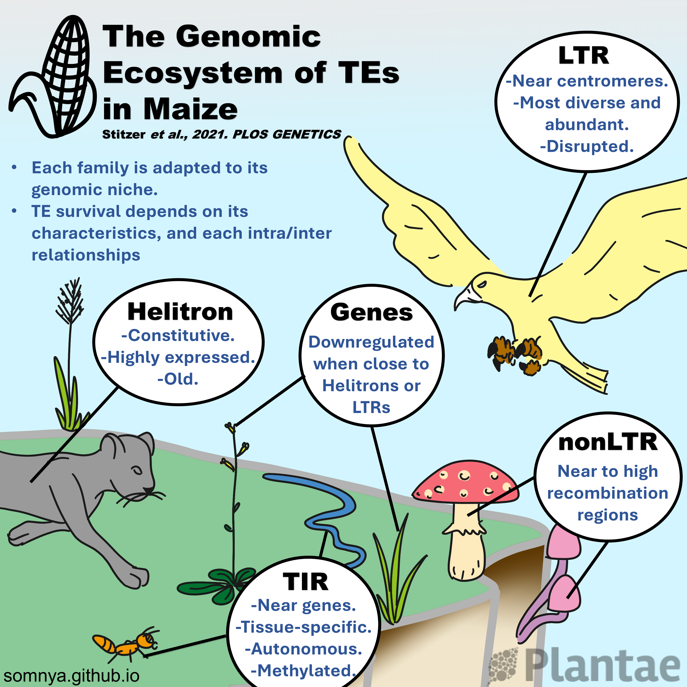

# My contributions to the Plantae Research Weekly:

## The genomic ecosystem of transposable elements in maize - Jan 21, 2022. [READ MORE](https://plantae.org/the-genomic-ecosystem-of-transposable-elements-in-maize-plos-genetics/)

