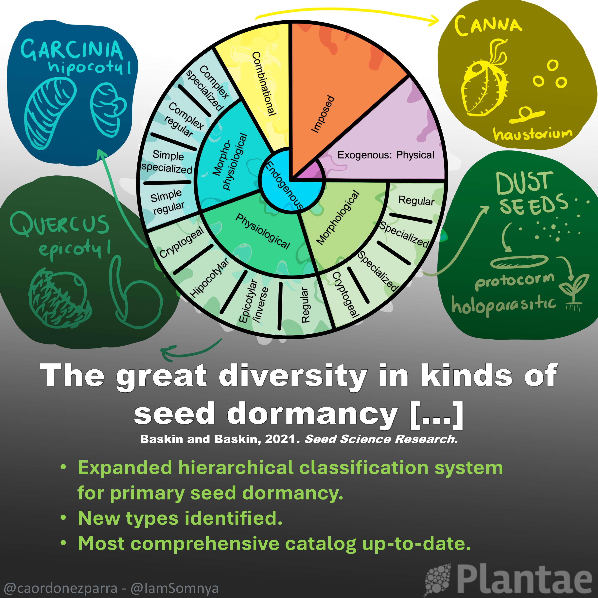
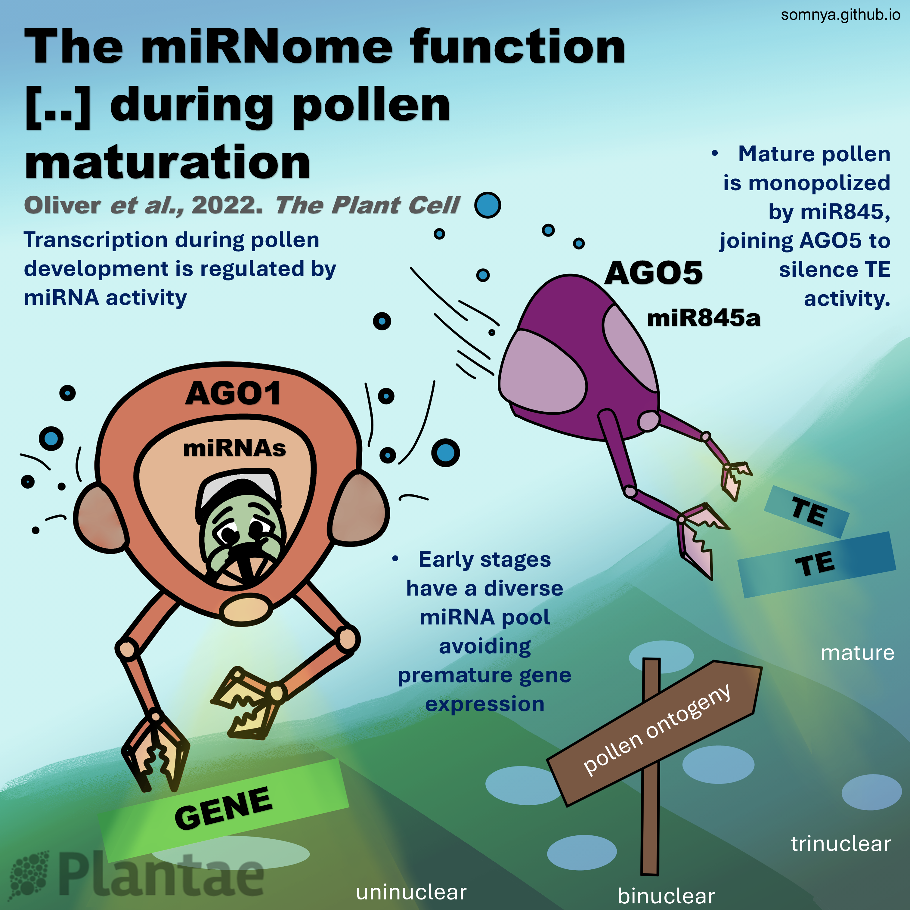

# My contributions to the Plantae Research Weekly:

## The genomic ecosystem of transposable elements in maize [READ MORE](https://plantae.org/the-genomic-ecosystem-of-transposable-elements-in-maize-plos-genetics/)

## The great diversity in kinds of seed dormancy [READ MORE](https://plantae.org/review-the-great-diversity-in-kinds-of-seed-dormancy-seed-sci-res/)

## The miRNome function transitions from regulating developmental genes to transposable elements during pollen maturation [READ MORE](https://plantae.org/the-mirnome-function-transitions-from-regulating-developmental-genes-to-transposable-elements-during-pollen-maturation-plant-cell/)

